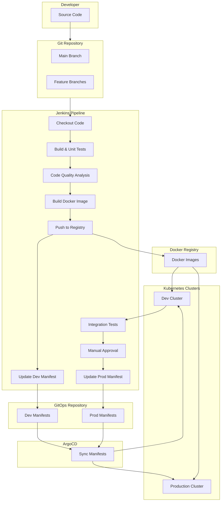

# MyBank API CI/CD Pipeline Documentation

## Overview

This document outlines the CI/CD pipeline architecture for the MyBank API application. The pipeline enables automated testing, building, and deployment of the Spring Boot application to Kubernetes clusters using GitOps principles.

## Architecture Diagram



## Process Flow

1. **Code Development**: Developers write code and push to Git repository
2. **Jenkins Pipeline Trigger**: Commits to the repository trigger the Jenkins pipeline
3. **Build & Test**: Application is built and unit tests are executed
4. **Code Quality**: SonarQube analyzes code quality and security
5. **Docker Image**: A Docker image is built and pushed to registry
6. **Dev Deployment**: The GitOps repository is updated with new image tag for development
7. **Integration Tests**: Tests are run against the deployed development environment
8. **Production Approval**: Manual approval is required for production deployment
9. **Production Deployment**: The GitOps repository is updated with new image tag for production
10. **GitOps Sync**: ArgoCD/Flux continuously monitors and syncs the GitOps repository with Kubernetes clusters

## Key Components

### 1. Source Code Repository
Contains the Spring Boot application code for the MyBank API.
```
/
├── src/
│   ├── main/
│   │   ├── java/
│   │   │   └── com/
│   │   │       └── mybank/
│   │   │           ├── config/
│   │   │           ├── controller/
│   │   │           ├── dto/
│   │   │           ├── entity/
│   │   │           ├── exception/
│   │   │           ├── repository/
│   │   │           ├── service/
│   │   │           └── MyBankApplication.java
│   │   │
│   │   └── resources/
│   │       ├── application.properties
│   │       ├── application-dev.properties
│   │       └── application-prod.properties
│   │
│   └── test/
│       └── java/
│           └── com/
│               └── mybank/
│
├── kubernetes/                   # Kubernetes manifests untuk referensi lokal
│   ├── deployment.yaml
│   ├── service.yaml
│   ├── ingress.yaml
│   └── configmap.yaml
│
├── Dockerfile
├── Jenkinsfile
├── pom.xml
├── mvnw
├── mvnw.cmd
└── README.md
```

### 2. Jenkins Pipeline
The Jenkinsfile defines the entire CI/CD process with the following stages:
- Checkout Code
- Build & Unit Tests
- Code Quality Analysis
- Docker Image Building
- Deployment to Development Environment
- Integration Testing
- Manual Approval for Production
- Deployment to Production Environment

### 3. Docker
- Uses `openjdk:17-jdk-slim` as base image
- Containerizes the Spring Boot application
- Enables consistent deployment across environments

### 4. GitOps Repository
Contains Kubernetes manifests organized by environment:
```
gitops-repo/
├── kubernetes/
│   ├── dev/
│   │   └── mybank/
│   │       ├── deployment.yaml
│   │       ├── service.yaml
│   │       ├── ingress.yaml
│   │       └── configmap.yaml
│   └── prod/
│       └── mybank/
│           ├── deployment.yaml
│           ├── service.yaml
│           ├── ingress.yaml
│           └── configmap.yaml
```

### 5. Kubernetes Resources
- **Deployment**: Manages pods running MyBank API
- **Service**: Exposes API internally within Kubernetes
- **Ingress**: Routes external traffic to the service
- **ConfigMap**: Stores configuration parameters

## Benefits of this Architecture

1. **Separation of Concerns**: Separates application code from deployment configurations
2. **Version Control**: All changes (code and configs) are tracked in Git
3. **Automation**: Minimal manual intervention required
4. **Consistency**: Same process for all environments
5. **Auditability**: Every change is tracked and can be traced
6. **Rollbacks**: Easy to revert to previous versions
7. **Scalability**: Easy to add new environments or services

## Setup Instructions

1. Configure Jenkins with necessary plugins and credentials:
   - Docker registry credentials
   - GitOps repository credentials
   - SonarQube configurations

2. Set up Kubernetes clusters with:
   - ArgoCD or Flux for GitOps
   - Proper namespaces (finance-apps)
   - Necessary RBAC permissions

3. Configure repository webhooks to trigger Jenkins pipeline on code changes

4. Customize the Kubernetes manifests in the GitOps repository according to specific requirements

## Monitoring and Maintenance

- Monitor Jenkins pipeline executions
- Check ArgoCD/Flux sync status
- Review application and infrastructure logs
- Perform regular security scans
- Update base images and dependencies regularly

## Troubleshooting

- Check Jenkins logs for pipeline failures
- Verify Docker registry connectivity
- Confirm Kubernetes cluster access
- Validate GitOps repository permissions
- Review application logs for runtime issues

---

This documentation provides a comprehensive overview of the CI/CD pipeline for the MyBank API application, explaining how changes flow from code commit to production deployment using Jenkins, Docker, and GitOps principles.